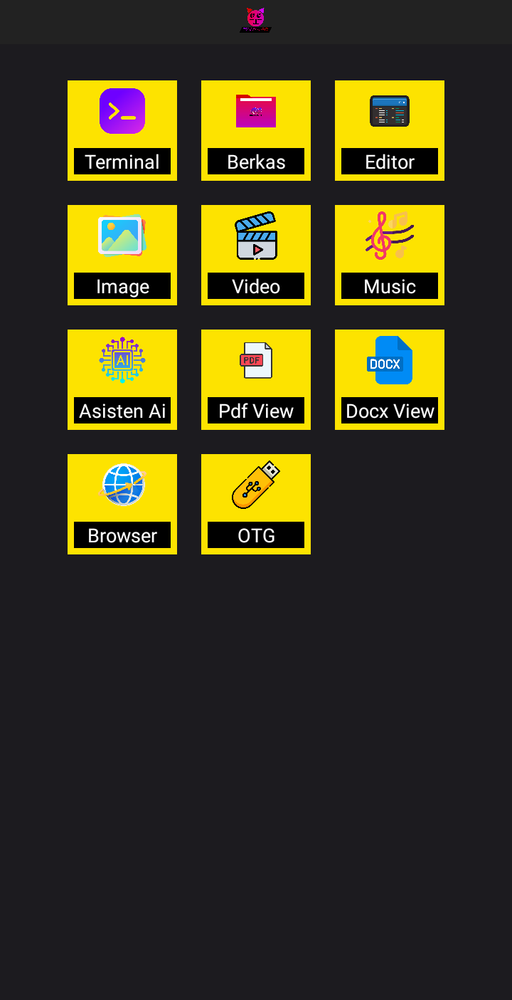

# Go-All

Proyek Android berbasis Kotlin yang menggunakan Jetpack Compose untuk membangun UI secara deklaratif.

## Fitur

- Jetpack Compose
- Material Theme
- Setup awal aplikasi Android modern

## Screenshot

## Cara Menjalankan

1. Buka project di Android Studio.
2. Pastikan sudah menggunakan Android Studio versi terbaru (Arctic Fox ke atas).
3. Klik "Run".

## Struktur File

- `MainActivity.kt`: Entry point aplikasi, memuat UI Compose dasar.

## Rencana Pengembangan

- Tambahkan fitur baru
- Navigasi antar halaman
- Integrasi API

## Lisensi

Proyek ini bersifat open-source.
